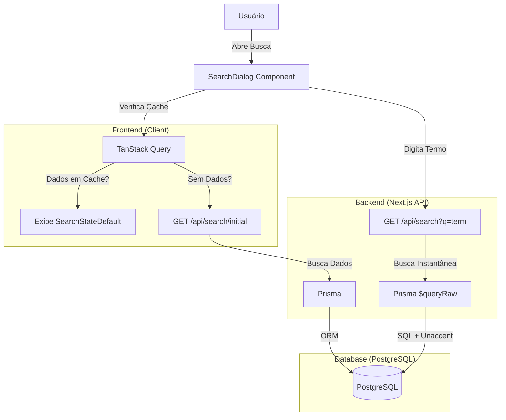

# Documentação da Feature de Busca

Este documento descreve a arquitetura, estratégia de cache e detalhes de implementação da funcionalidade de busca do Moto Log App.

## 1. Arquitetura

O fluxo de busca segue uma arquitetura otimizada para performance e consistência entre Mobile e Desktop.



### Componentes Principais
- **`SearchDialog`**: Componente UI responsivo (Modal no Desktop, Fullscreen no Mobile). Gerencia estado da busca e exibição de resultados.
- **`useSearchInitialData`**: Hook customizado que gerencia o cache dos dados iniciais (Lojas, Categorias, Produtos).
- **`/api/search/initial`**: Endpoint para dados sugeridos (Lojas em alta, Categorias ativas, Best Sellers).
- **`/api/search`**: Endpoint para busca instantânea com suporte a acentos.

---

## 2. Estratégia de Cache

Utilizamos uma estratégia de cache em duas camadas (Browser + CDN/Server) para garantir performance máxima.

### Dados Iniciais (`/api/search/initial`)
- **Objetivo**: Exibir conteúdo relevante instantaneamente ao abrir a busca.
- **Browser (TanStack Query)**: `staleTime: 1 hora`.
  - O usuário só faz download desses dados uma vez por sessão (ou a cada hora).
  - Abertura do modal é instantânea (0ms network latency) se os dados estiverem em memória.
- **Server (Cache-Control)**: `s-maxage=3600, stale-while-revalidate=7200`.
  - CDN/Vercel cacheia a resposta por 1 hora.
  - `stale-while-revalidate` permite servir dados "velhos" por mais 2 horas enquanto atualiza em background.

### Busca Instantânea (`/api/search`)
- **Objetivo**: Responder rapidamente enquanto o usuário digita.
- **Server (Cache-Control)**: `s-maxage=60, stale-while-revalidate=300`.
  - Cache curto (1 minuto) para garantir que novos produtos/lojas apareçam rapidamente.

---

## 3. Banco de Dados e Queries

### Extensão `unaccent`
Para garantir que buscas como "joao" encontrem "João" e "pecas" encontrem "Peças", utilizamos a extensão `unaccent` do PostgreSQL.

- **Instalação**: `CREATE EXTENSION IF NOT EXISTS unaccent;` (via Migration).
- **Uso**: Queries Raw SQL são necessárias pois o Prisma Core ainda não suporta `unaccent` nativamente em filtros `contains`.

### Queries Raw SQL
No endpoint `/api/search`, utilizamos `$queryRaw` para aplicar o `unaccent` e mapear os campos para o formato esperado pelo frontend (camelCase).

**Exemplo de Query (Produtos):**
```sql
SELECT 
    p.id,
    p.nome,
    p."imagemUrl",
    p.preco,
    p."porcentagemDesconto",
    c.nome as "categoriaNome"
FROM "Produto" p
INNER JOIN "Categoria" c ON p."categoriaId" = c.id
WHERE p.status = 'ATIVO'
  AND (
    unaccent(p.nome) ILIKE unaccent($1)
    OR unaccent(p.descricao) ILIKE unaccent($1)
  )
LIMIT 5
```

---

## 4. Guia de Manutenção

### Adicionar Novos Campos na Busca
1. **Frontend**: Atualize a interface `ProductResult` ou `StoreResult` em `src/app/api/search/route.ts`.
2. **Backend**: Adicione o campo no `SELECT` da query SQL correspondente. Lembre-se de usar aspas duplas para campos camelCase no SQL (ex: `p."imagemUrl"`).

### Alterar Ordenação dos Dados Iniciais
Edite `src/app/api/search/initial/route.ts`.
- **Lojas**: Atualmente ordenadas por popularidade (`followers`).
- **Produtos**: Atualmente ordenados por vendas (`totalVendido`).

### Debugging
- **Flash de Loading**: Se o skeleton aparecer indevidamente, verifique se a lógica `{isLoadingInitial && !data}` no `SearchDialog` foi alterada.
- **Busca não traz resultados**: Verifique se a extensão `unaccent` está ativa no banco de dados (`SELECT * FROM pg_extension;`).
